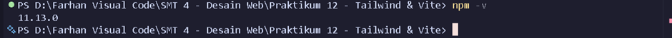
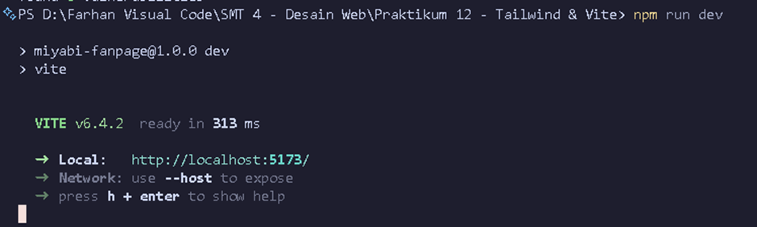
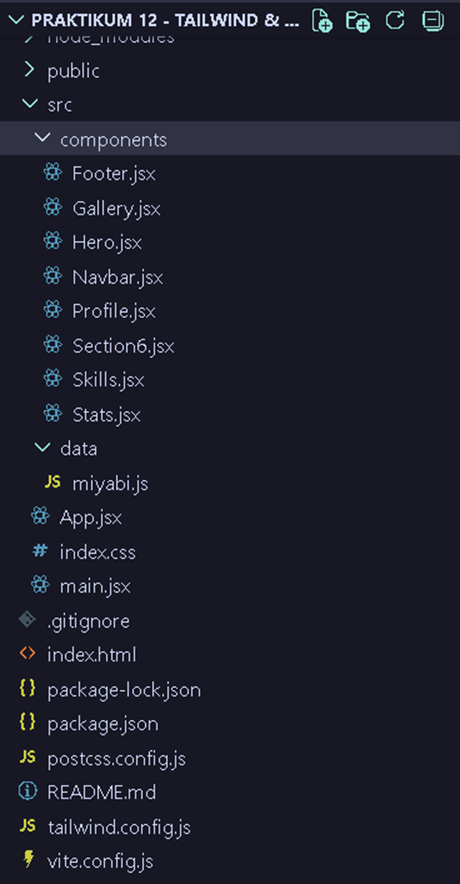
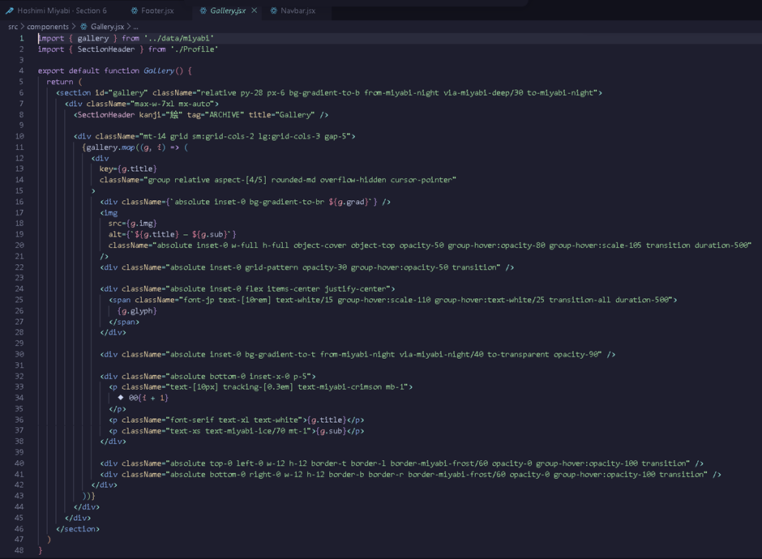
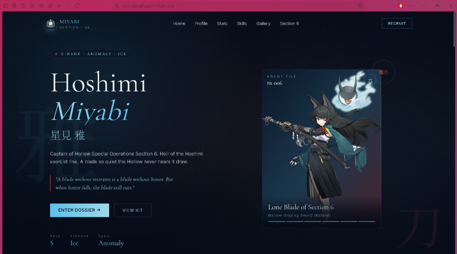
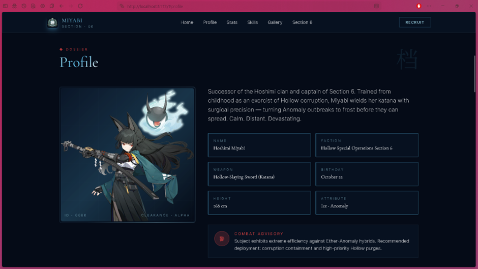
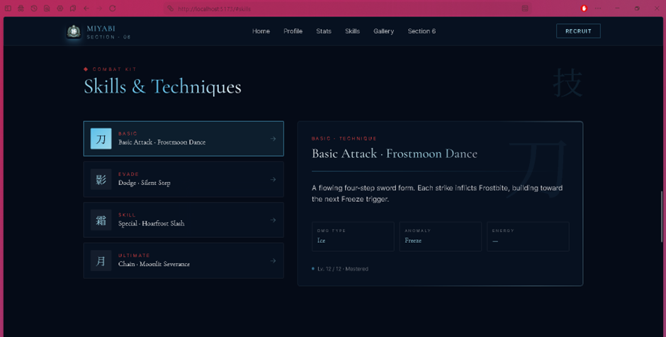

# Hoshimi Miyabi · Section 6 — Character Fan Page

Tugas Praktikum **Modul 14 (React JS)** & **Praktikum 12 (Tailwind & Vite)**.
Aplikasi frontend bertema **Hoshimi Miyabi** (Zenless Zone Zero) yang dibangun dengan
**React + Vite + Tailwind CSS**.

---

## Tech Stack
- **Vite 6** — build tool
- **React 18** — UI library (komponen, props, state)
- **Tailwind CSS 3** — styling utility-first
- Google Fonts: Cormorant Garamond, Inter, Noto Serif JP

---

## Cara Menjalankan

```bash
# 1. Install dependency
npm install

# 2. Jalankan development server
npm run dev
```

Buka URL yang ditampilkan Vite (default: http://localhost:5173).

Build untuk production:
```bash
npm run build
npm run preview
```

---

## Struktur Project

```
├─ index.html
├─ vite.config.js · tailwind.config.js · postcss.config.js
├─ public/
│  ├─ miyabi_card.webp      (portrait karakter)
│  ├─ Katana.webp           (promo senjata "Tailless")
│  ├─ tailless.jpeg         (wujud seal)
│  └─ section6_crest.webp   (logo)
└─ src/
   ├─ main.jsx              (ReactDOM.createRoot)
   ├─ App.jsx               (komposisi utama)
   ├─ index.css             (direktif Tailwind)
   ├─ data/miyabi.js        (data: profile, stats, skills, gallery)
   └─ components/
      ├─ Navbar.jsx
      ├─ Hero.jsx
      ├─ Profile.jsx        (juga export SectionHeader)
      ├─ Stats.jsx          (bar animasi, IntersectionObserver)
      ├─ Skills.jsx         (tab interaktif, useState)
      ├─ Gallery.jsx
      ├─ Section6.jsx
      └─ Footer.jsx
```

---

## Fitur
- Responsive (mobile menu + grid fluid)
- Smooth-scroll navigation antar section
- Bar statistik beranimasi saat di-scroll
- Tab Skills interaktif (state)
- Galeri kartu dengan gambar (props dari data)
- Penggunaan tag **div, p, h, img** sesuai ketentuan modul

---

## Screenshot

> Ganti setiap placeholder di bawah dengan screenshot Anda.
> Simpan gambar di folder `docs/screenshots/` lalu sesuaikan nama filenya.

### 1. Versi Node.js & npm
<!-- node -v dan npm -v di terminal -->



<br>

### 2. Menjalankan `npm run dev`
<!-- terminal menampilkan URL Local http://localhost:5173 -->



<br>

### 3. Struktur Folder di VS Code
<!-- panel Explorer memperlihatkan src/ dan components/ -->



<br>

### 4. Potongan Kode JSX (div / p / h / img)
<!-- editor pada Hero.jsx atau Gallery.jsx yang memuat tag img, div, p, h -->



<br>

### 5. Tampilan Hero / Beranda



<br>

### 6. Tampilan Profile & Stats



<br>

### 7. Tampilan Skills & Gallery



---

## Catatan
Proyek ini dibuat untuk keperluan tugas kuliah (educational).
Bukan proyek resmi dan tidak berafiliasi dengan HoYoverse.
Seluruh karakter dan aset merupakan milik pemegang hak masing-masing.
